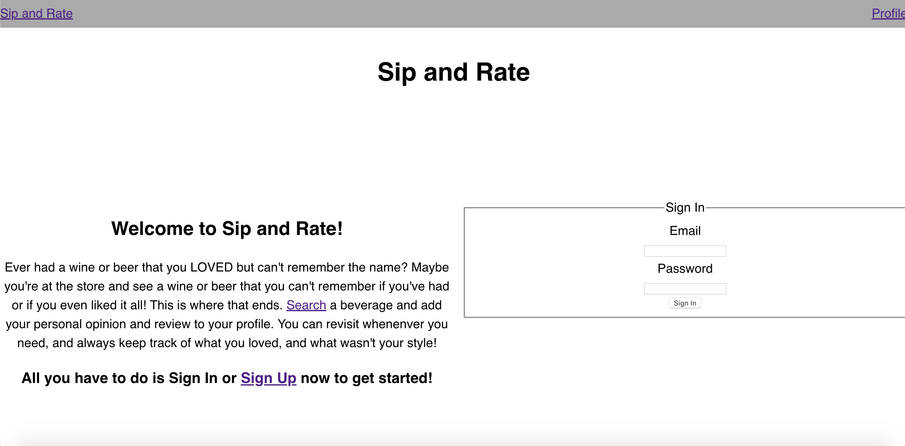
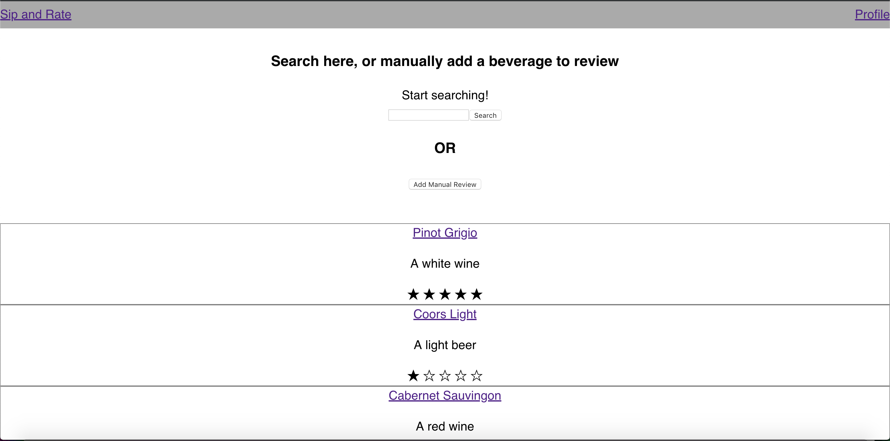
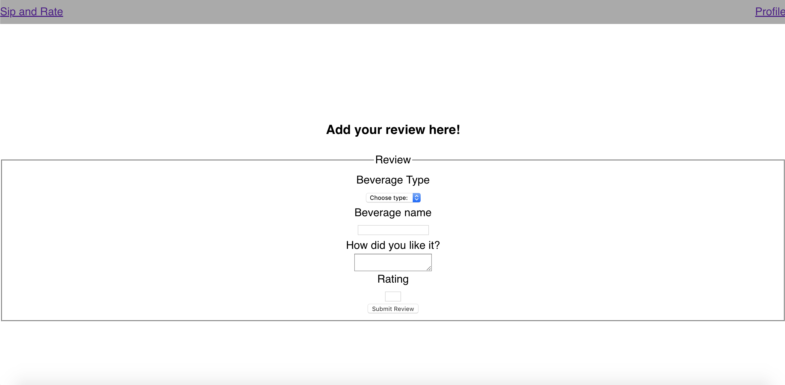
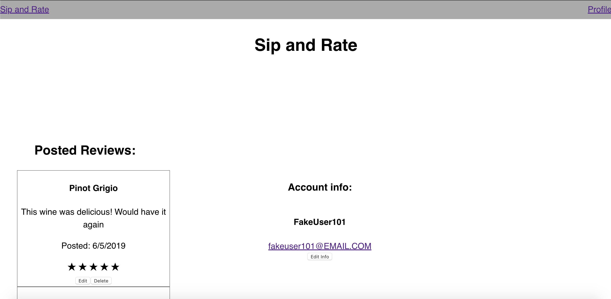

# Sip & Rate
<a href="https://github.com/bahitssara/sip-and-rate-api/" target="_blank">Sip & Rate API Repo</a> 
<a href="https://sip-and-rate.saraamayberry.now.sh/" target="_blank">Live App</a> 

## Motivation 
I was inspired to create an app that allows wine lovers to search their favorite or least favorite wines, and store their thoughts about that wine all in one place. As a wine lover myself I've found it's easy to have a wine and not remember at all how I felt about it. Then was born Sip & Rate! 

## User Stories

## Screenshots
### Wire Frames

## Summary
Sip & Rate is an app that allows users to create a simple account, and once logged in can search a wine they've had, and give their thoughts! This app is focused for personal use and aimed at frequent users who return to view all their thoughts! Users can also view all posted reviews, just to see what others may think. This app is the perfect place to keep tabs on all your favorite and least favorite grape beverages! 

## Built with 
    -HTML
    -Javascript
    -React
    -Node.js
    -CSS

## Available Scripts

In the project directory, you can run:

### `npm start`

Runs the app in the development mode. 
Open [http://localhost:3000](http://localhost:3000) to view it in the browser.

The page will reload if you make edits. 
You will also see any lint errors in the console.

