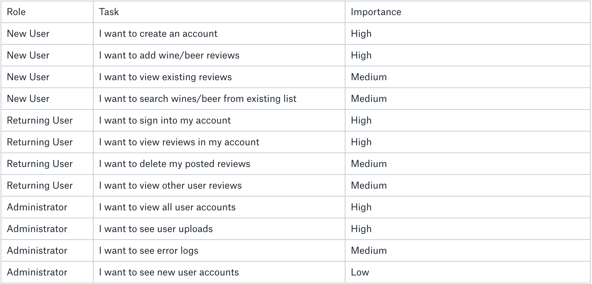

# Sip & Rate

## Motivation 

## User Stories

## Screenshots

## Summary

## Built with 
    -HTML
    -Javascript
    -React
    -Node.js
    -CSS

## Available Scripts

In the project directory, you can run:

### `npm start`

Runs the app in the development mode. 
Open [http://localhost:3000](http://localhost:3000) to view it in the browser.

The page will reload if you make edits. 
You will also see any lint errors in the console.

